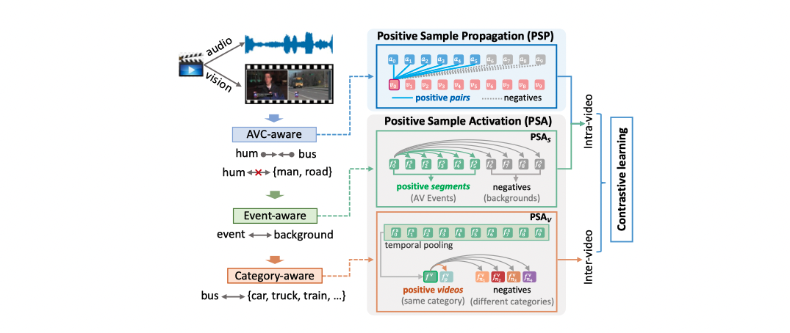

#### This repository introduces a newly collected large-scale dataset VGGSound-AVEL100k for audio-visual event localization task and contains some baseline methods for localization and video parsing tasks. It assembles the [AVEL](https://github.com/YapengTian/AVE-ECCV18), [AVSDN](https://arxiv.org/pdf/1902.07473.pdf), [CMRAN](https://github.com/FloretCat/CMRAN), [PSP](https://github.com/jasongief/PSP_CVPR_2021), and implements the CPSP and SSPSP methods. 

-----

### VGGSound-AVEL100k: A large-scale dataset for audio-visual event localization
For the Audio-Visual Event Localization (AVEL) task, there is only the [**AVE**](https://openaccess.thecvf.com/content_ECCV_2018/papers/Yapeng_Tian_Audio-Visual_Event_Localization_ECCV_2018_paper.pdf) dataset containing ~4k videos for training and evaluation. Here, we collected a new large-scale VGGSound-AVEL100k dataset. It contains 101,072 videos covering 141 event categories. The videos are sampled from the [**VGGSound**](https://arxiv.org/abs/2004.14368) dataset. Compared to the AVE dataset, VGGSound-AVEL100k contains more scenes in real-life.

A comparison of the AVE and VGGSound-AVEL100k datasets can be seen in the following Table.
<!-- ### Comparison between AVEL and VGGSound-AVEL. datasets -->

| Dataset           | #category | #videos | #train set | #val. set | #test set |
| :---------------- | --------- | -------: | ----------: | ---------: | ---------:|
| AVE               | 28        | 4,143   | 3,339      | 402       | 402        |
| VGGSound-AVEL100k | 141       |101,072  | 60,640     | 20,216    | 20,216     |

**Dataset statistics.** A full list of the category names and video number of each category can be seen from [here](https://drive.google.com/file/d/1gFZAKKHE35OJ58jjx7d2F1REu_DilSoI/view?usp=sharing).

**Downloads**. The VGGSound-AVEL100k is available [here](https://drive.google.com/drive/folders/1en1dks1GYiGaDS9Ar-QtJmmyoOdzEsQj?usp=sharing). You may need to extract the audio-visual features by yourself because the file size is too large so we do not upload the features. The audio and visual features are extracted by the pretrained VGGish and VGG-19 networks respectively. The users can extract them by themselves and some helpful scripts can be found in [AVEL](https://github.com/YapengTian/AVE-ECCV18). **Note**: We also provide a relatively lightweight version of the VGGSound-AVEL100k dataset, called VGGSound-AVEL50k, to meet the flexible needs of researchers. VGGSound-AVEL50k still covers 141 event categories but only **half** as many videos as VGGSound-AVEL100k. For each event category, we randomly select 50% of videos from VGGSound-AVEL100k. This yields a total of 50,543 videos and the train/validation/test split of the videos remains the same as for VGGSound-AVEL100k. VGGSound-AVEL50k can be downloaded from [here](https://drive.google.com/drive/folders/1651uLMPRB-tOz3sEun_DWo9WefxsVPAF?usp=sharing). We highly recommend to use VGGSound-AVEL50k dataset as we found that it has higher-quality annotations.

-----
### The CPSP method for AVEL
In this repository, we introduce a new Contrastive Positive Sample Propagation (CPSP) method for AVEL problem. CPSP is built up on our previous work [PSP](https://github.com/jasongief/PSP_CVPR_2021) and it is also useful for the more challenging audio-visual video parsing task.

Specifically, the PSP mainly focuses on the pair-level audio-visual learning by selecting the most relevant audio-visual segment pairs for feature aggregation (**AVC-aware**). Then the learned audio-visual features are synchronized concatenated for final classification just like most existing methods. Unlike this, the CPSP adds a positive sample activation ($PSA$) module that explicitly performs contrastive learning from both segment-level ($PSA_s$) and video-level ($PSA_v$). The $PSA_s$ aims to make model more **event-aware** by distinguishing the segments containing an AVE or background; The $PSA_v$ aims to make model more **category-aware** by identifying different event categories. The positive and negative samples can be selected for contrastive learning according to the segment label and category label.
An illustration of the CPSP is shown below.




-----
###  for Audio-Visual Event Localization 
#### fully supervised setting
- Train
```
cd cpsp_avel
bash run_fully_supv.sh
```

#### weakly supervised setting
- Train
```
cd cpsp_avel
bash run_weakly_supv.sh
```

------
### for Audio-Visual Video Parsing
- Train
```
cd cpsp_avvp
bash run.sh
```

We also provide the pretrained psp/cpsp models for these tasks, you can download it from [here](https://drive.google.com/drive/folders/1sMMild9eZ6WEj_9b5QW1ZMYNWzw0Ah54?usp=sharing).


------
### Citation
Please consider cite following paper if it is helpful in your research or projects:
```
@inproceedings{chen2020vggsound,
  title={Vggsound: A large-scale audio-visual dataset},
  author={Chen, Honglie and Xie, Weidi and Vedaldi, Andrea and Zisserman, Andrew},
  booktitle={ICASSP 2020-2020 IEEE International Conference on Acoustics, Speech and Signal Processing (ICASSP)},
  pages={721--725},
  year={2020}
}

@inproceedings{zhou2021PSP,
  title={Positive Sample Propagation along the Audio-Visual Event Line},
  author={Zhou, Jinxing and Zheng, Liang and Zhong, Yiran and Hao, Shijie and Wang, Meng},
  booktitle={Proceedings of the IEEE/CVF Conference on Computer Vision and Pattern Recognition},
  pages={8436--8444},
  year={2021}
}

@article{zhou2022CPSP,
  title={Contrastive Positive Sample Propagation along the Audio-Visual Event Line},
  author={Zhou, Jinxing and Guo, Dan and Wang, Meng},
  journal={IEEE Transactions on Pattern Analysis and Machine Intelligence},
  year={2022},
  publisher={IEEE}
}
```
